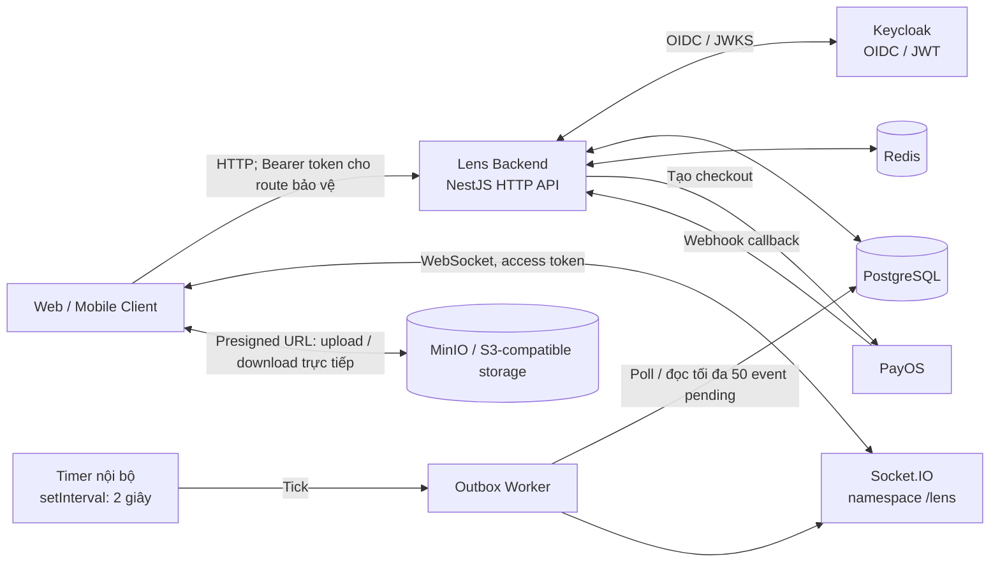
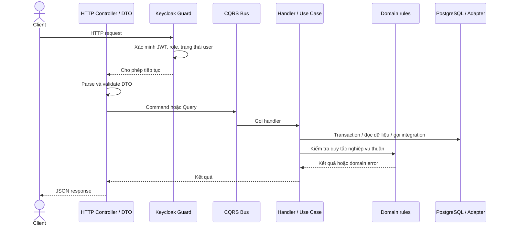
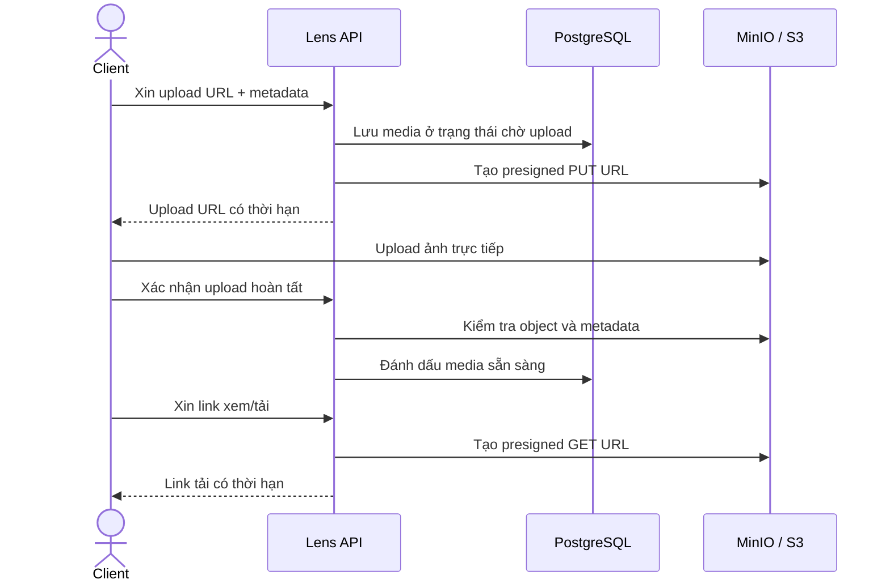

# Lens Backend — Thuyết trình công nghệ và kiến trúc

> Tài liệu tập trung vào phần backend trong repo: kiến trúc, công nghệ, luồng xử lý kỹ thuật và các quyết định triển khai. Có thể dùng làm kịch bản thuyết trình khoảng 6–8 phút. Frontend/web/mobile không nằm trong repo này.

## 1. Giới thiệu ngắn

**Lens** là nền tảng kết nối khách hàng với nhiếp ảnh gia. Backend cung cấp API cho các chức năng như tài khoản, hồ sơ, booking, thanh toán và quản lý ảnh.

Điểm chính khi trình bày phần kỹ thuật là cách backend chia module theo miền nghiệp vụ, quản lý request qua NestJS/CQRS, lưu dữ liệu trong PostgreSQL, xác thực bằng Keycloak, và kết nối các dịch vụ ngoài như PayOS, Redis, MinIO/S3-compatible storage và Socket.IO.

## 2. Sơ đồ tổng thể



Backend được tổ chức theo kiểu **modular monolith**: một ứng dụng NestJS duy nhất, trong đó các module nghiệp vụ có ranh giới riêng. Frontend không gửi file ảnh qua API server; backend cấp presigned URL để client giao tiếp trực tiếp với object storage.

## 3. Luồng xử lý kỹ thuật

### 3.1. Luồng HTTP request



- **Controller** nhận HTTP, parse path/query/body và chuyển dữ liệu thành command hoặc query.
- **ValidationPipe** chạy toàn cục để transform DTO, áp dụng whitelist và từ chối field không khai báo.
- **KeycloakGuard** xác minh access token qua JWKS, sau đó kiểm tra role và trạng thái user theo metadata của route.
- **Command/Query Handler** chuyển request sang use case; command mở transaction với TypeORM `DataSource`.
- **Use case** điều phối truy vấn, quyền sở hữu, domain rule và tích hợp.
- **Domain** giữ các quy tắc nghiệp vụ với ít phụ thuộc framework, ví dụ kiểm tra trạng thái hoặc tính tiền. Ranh giới được áp dụng theo hướng thực dụng; booking domain hiện dùng lại status constants khai báo trong TypeORM entity.

### 3.2. Xác thực Keycloak và Redis

Với đăng nhập Google, backend tạo PKCE verifier/challenge và `state`; Redis lưu state dùng một lần trong 10 phút. Sau callback, backend dùng authorization code đổi token với Keycloak, xác minh access token bằng JWKS rồi đồng bộ hồ sơ Lens.

Ở các request tiếp theo, client gửi Keycloak **access token** dưới dạng Bearer. Backend không dùng ID token thay cho access token. Redis trong luồng hiện tại chủ yếu lưu trạng thái PKCE; dữ liệu nghiệp vụ chính vẫn nằm trong PostgreSQL.

### 3.3. Database, CQRS và transaction

- Các thao tác ghi đi theo Command; các thao tác đọc đi theo Query.
- CQRS hiện là tách biệt ở tầng ứng dụng. Cả command và query vẫn làm việc với PostgreSQL; repo chưa cấu hình MongoDB làm read database.
- TypeORM cung cấp EntityManager và transaction. Migration schema được viết bằng SQL và chạy riêng; TypeORM `synchronize` bị tắt.
- Tạo booking khóa bản ghi photographer bằng pessimistic write lock trong transaction để hạn chế race condition khi có request đặt lịch đồng thời.
- Các context giao tiếp qua port khi cần khả năng từ context khác, ví dụ Payment cung cấp port cho Subscription tạo payment intent.

### 3.4. Upload và đọc ảnh



Storage adapter dùng AWS SDK for JavaScript v3 và giao thức S3-compatible. Cấu hình runtime hiện chọn MinIO. Backend kiểm tra file đã tồn tại và metadata trước khi cho media vào portfolio hoặc gallery; presigned URL mặc định có TTL 900 giây.

### 3.5. Thanh toán, webhook và realtime

Luồng thanh toán đang được nối vào runtime dùng `PaymentUseCases` cùng `PayOsGateway`:

1. `PaymentDepositCommandHandler` hoặc `PaymentRemainingCommandHandler` mở transaction và yêu cầu use case tạo/tái sử dụng transaction intent. Use case kiểm tra quyền customer trên booking, trạng thái booking và điều kiện phải trả cọc trước phần còn lại.
2. Intent được ghi vào PostgreSQL trước khi gọi PayOS. Database cấp `provider_order_code`; transaction mặc định `pending` và gateway là `payos`.
3. Sau khi transaction commit, handler gọi `fulfill()` để tạo checkout/VietQR rồi lưu `checkout_url` và `qr_code` vào transaction bằng một transaction mới. Nếu lần tạo link lỗi mơ hồ, adapter tra order theo cùng mã với PayOS để khôi phục checkout.
4. PayOS gọi `POST /payments/webhooks/:provider`. Webhook được xác minh chữ ký; use case đối chiếu order code, provider, số tiền và reference đã xử lý trong `payment_webhooks` trước khi chuyển transaction sang `paid`.
5. Với booking, backend ghi sự kiện `payment.received`; với subscription, backend kích hoạt subscription và ghi `payment.subscription`. `paidAmounts()` được Booking gọi qua port để tính tổng tiền đã thanh toán.
6. Refund hiện chỉ tạo `refund_requests` sau khi kiểm tra giao dịch đã trả và tổng số tiền refund không vượt khoản đã thu; đoạn này không thực hiện chuyển tiền hoàn qua PayOS.

Các endpoint chính: `POST /bookings/:booking_id/payments/deposit`, `POST /bookings/:booking_id/payments/remaining`, `GET /bookings/:booking_id/payments`, `GET /payments/:payment_id/qr`, `POST /payments/webhooks/:provider`, `POST /payments/:payment_id/refund`.

**Phạm vi payment hiện tại:** `PaymentApiModule` và `ApiRuntimeModule` đăng ký `PaymentUseCases` với `PayOsGateway`, nên endpoint đang chạy theo luồng PayOS. Có file `collection/payment-collection.use-case.ts` chứa hướng mở rộng payment method/provider, nhưng class này chưa được wiring vào runtime; không nên trình bày wallet hoặc thanh toán đa provider như tính năng đang hoạt động.

Một số command ghi sự kiện vào `outbox_events` trong cùng transaction với dữ liệu nghiệp vụ. Outbox Worker tự kích hoạt bằng `setInterval` mỗi 2 giây, poll PostgreSQL tối đa 50 event pending mỗi lượt rồi phát qua Socket.IO namespace `/lens`, vào room riêng của từng user. PostgreSQL không phát tín hiệu đánh thức worker; độ trễ nhận event phụ thuộc chu kỳ poll.

**Giới hạn triển khai hiện tại:** worker cập nhật `processed_at` trước khi phát Socket.IO. Nếu publisher lỗi sau thời điểm đó, event có thể không được tự retry. Nên mô tả đây là luồng outbox bất đồng bộ, không cam kết delivery đúng một lần.

## 4. Công nghệ trong project

| Công nghệ                        | Vai trò kỹ thuật                                                                  |
| -------------------------------- | --------------------------------------------------------------------------------- |
| **Node.js + TypeScript**         | Runtime và ngôn ngữ backend có kiểu tĩnh.                                         |
| **NestJS 12**                    | HTTP server, dependency injection, module, guards, validation, CQRS và WebSocket. |
| **PostgreSQL 16**                | Cơ sở dữ liệu quan hệ chính cho dữ liệu ứng dụng và outbox.                       |
| **TypeORM**                      | Mapping entities, truy vấn, transaction và pessimistic lock.                      |
| **Keycloak 24, OIDC, JWT/JWKS**  | Identity provider, đăng nhập Google qua broker và xác minh access token.          |
| **Redis 7**                      | Lưu PKCE state ngắn hạn; được dùng bởi module tích hợp Keycloak.                  |
| **PayOS**                        | Tạo checkout/VietQR và xác minh webhook thanh toán.                               |
| **AWS SDK v3 + MinIO**           | S3-compatible object storage và presigned URL cho ảnh.                            |
| **Socket.IO**                    | Kênh realtime theo user room, namespace `/lens`.                                  |
| **Axios + axios-retry**          | HTTP client dùng cho tích hợp backend với dịch vụ ngoài.                          |
| **Swagger / OpenAPI**            | Sinh tài liệu và giao diện thử API tại `/docs`.                                   |
| **Docker Compose**               | Khởi chạy dịch vụ hỗ trợ cho môi trường local.                                    |
| **pnpm, Jest, ESLint, Prettier** | Quản lý package, công cụ kiểm thử và chuẩn hóa code.                              |

## 5. Các quyết định kiến trúc đáng trình bày

### Modular monolith theo domain

Code được chia thành các context như Identity, Photographer, Calendar, Booking, Payment, Media, Subscription, Feedback và Moderation. Mỗi context giữ use case, command/query handler và domain rules liên quan. Cách này tạo ranh giới rõ trong code mà không cần giao tiếp mạng giữa các module.

### Clean Architecture theo hướng thực dụng

- `features/` chứa adapter đầu vào/đầu ra: HTTP API, WebSocket, worker.
- `modules/` chứa use case và domain theo nghiệp vụ.
- `shared/` chứa database, contract, auth và adapter tích hợp ngoài.
- Phần lớn domain rules không chứa I/O; use case có thể dùng TypeORM `EntityManager` để điều phối dữ liệu. Một số hằng số domain hiện vẫn được chia sẻ qua entity.

### CQRS ở tầng ứng dụng

Command và Query có handler riêng, giúp tách cách ghi và đọc cũng như làm rõ ranh giới transaction. Đây chưa phải kiến trúc có database riêng cho read model: PostgreSQL là nơi xử lý cả hai hướng.

### Port và adapter

Context khai báo port cho năng lực cần dùng từ context khác; `ApiRuntimeModule` nối port với implementation cụ thể. Các dịch vụ ngoài như PayOS và object storage cũng được gọi qua adapter/integration layer.

### Transactional Outbox

Outbox lưu sự kiện trong cùng PostgreSQL transaction với thay đổi chính, rồi worker phát realtime sau đó. Pattern này giúp tránh ghi dữ liệu thành công nhưng quên tạo bản ghi sự kiện. Cách xử lý retry/delivery hiện vẫn có giới hạn như mô tả ở mục 3.5.

## 6. API, bảo mật và quản lý schema

- API dùng REST/JSON; tài liệu OpenAPI có thể xem tại `/docs`.
- Guard xác thực JWT qua Keycloak JWKS, kiểm tra role và liên kết actor trong token với user trong database.
- Quyền sở hữu được kiểm tra trong use case cho các resource như booking, media và portfolio.
- DTO validation chạy toàn cục; request có field không nằm trong DTO sẽ bị từ chối.
- Tiền được biểu diễn bằng số nguyên VND; thời gian API dùng ISO 8601 có timezone.
- SQL schema nằm trong `migrations/`; `pnpm db:migrate` chạy migration có checksum. Database không tự thay đổi schema khi app start.
- Biến môi trường và cấu hình tích hợp được đọc qua module Env; hướng dẫn nằm tại `docs/SECRETS_GUIDE.md`.

## 7. Thành phần cấu hình có nhưng chưa nối vào luồng runtime chính

Khi trình bày technology, nên phân biệt thư viện/cấu hình trong repo với thành phần đang được Core sử dụng:

- **MongoDB / Mongoose:** có trong Docker Compose và dependencies, nhưng `CoreModule` hiện không khởi tạo kết nối MongoDB; query đang dùng PostgreSQL.
- **BullMQ:** runtime có cấu hình kết nối BullMQ với Redis, nhưng hiện chưa thấy Queue/Processor nghiệp vụ được đăng ký. Outbox Worker vẫn dùng timer và PostgreSQL.
- **Redis Socket.IO adapter:** có mã adapter, nhưng Core hiện chưa cài adapter đó vào Socket.IO server. Redis vẫn được dùng trong PKCE flow.
- **Kong:** có thể chạy theo Docker Compose profile `full`, nhưng không bắt buộc để Core API hoạt động.

Điểm phân biệt này giúp phần trình bày phản ánh đúng implementation đang chạy, thay vì chỉ liệt kê mọi package trong `package.json`.

## 8. Cấu trúc mã nguồn

```text
apps/
  core/                 Bootstrap ứng dụng HTTP NestJS
  cli/                  Entry point CLI
src/
  features/
    api/                Controllers, DTO, auth, Swagger, module wiring
    socketio/           Socket.IO gateway
    workers/            Outbox worker
  modules/              Domain/use case/command/query theo context
  shared/
    database/           Entities, PostgreSQL, TypeORM, Redis
    integrations/       Keycloak, PayOS, object storage, Axios
    contracts/          Input contract dùng chung
migrations/             SQL migration
scripts/                Migration, seed và cấu hình dịch vụ
docs/                   Tài liệu kiến trúc và vận hành
test/                   Unit, contract và integration tests
```

## 9. Chạy thử và demo theo hướng kỹ thuật

1. Cài package: `pnpm install`.
2. Cấu hình môi trường theo `docs/SECRETS_GUIDE.md`.
3. Chạy dịch vụ local: `pnpm docker:up`.
4. Tạo schema: `pnpm db:migrate`.
5. Khởi động API: `pnpm start:dev`.
6. Mở Swagger tại `http://localhost:3000/docs`.
7. Demo một request qua Swagger để trình bày DTO validation, Bearer auth và luồng Controller → CQRS handler → Use case → PostgreSQL.
8. Nếu có cấu hình dịch vụ, demo presigned upload với MinIO, webhook PayOS hoặc sự kiện Socket.IO.

Keycloak và Kong trong Docker Compose nằm ở profile `full`. Server mặc định dùng port 3000; có thể đổi bằng biến `PORT`.

## 10. Kịch bản nói ngắn

> “Lens Backend được xây dựng bằng NestJS và tổ chức theo modular monolith. Mỗi nhóm chức năng có context riêng; HTTP Controller nhận request rồi chuyển qua CQRS handler và use case. PostgreSQL là nguồn dữ liệu chính, TypeORM quản lý transaction, còn domain giữ các quy tắc độc lập framework. Keycloak xử lý định danh, Redis giữ PKCE state ngắn hạn, PayOS xử lý checkout và webhook, MinIO lưu ảnh qua presigned URL. Với realtime, backend ghi outbox trong transaction rồi worker phát sự kiện qua Socket.IO. Kiến trúc hiện tại tách command và query ở tầng ứng dụng nhưng vẫn dùng chung PostgreSQL.”

## 11. Tài liệu mã nguồn tham khảo

- [README.md](README.md) — tổng quan và lệnh chạy.
- [docs/ARCHITECTURE_GUIDE.md](docs/ARCHITECTURE_GUIDE.md) — kiến trúc, CQRS và port.
- [docs/backend-implementation.md](docs/backend-implementation.md) — luồng runtime và API.
- [docs/database-decisions.md](docs/database-decisions.md) — PostgreSQL và migration.
- [docs/SECRETS_GUIDE.md](docs/SECRETS_GUIDE.md) — cấu hình môi trường.
- [src/features/api/api-runtime.module.ts](src/features/api/api-runtime.module.ts) — composition root và wiring.
- [src/features/workers/outbox.worker.ts](src/features/workers/outbox.worker.ts) — outbox worker.
