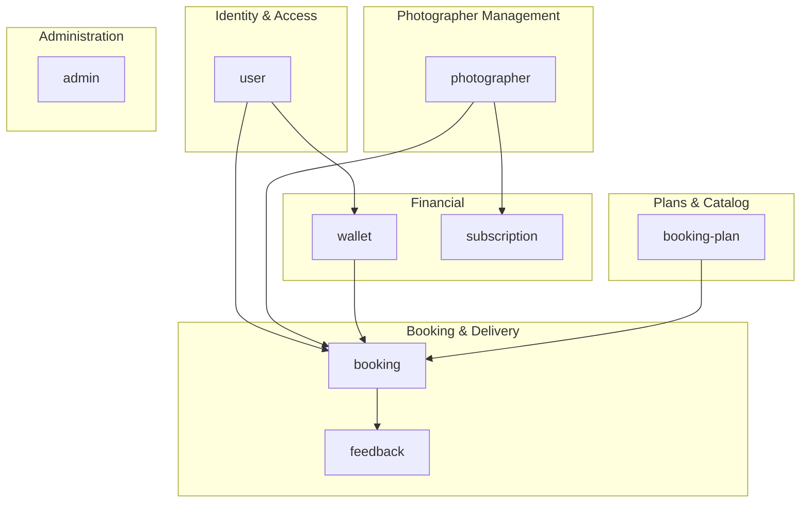
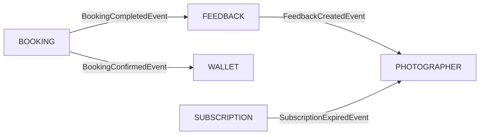

# ĐỀ XUẤT PHÂN CHIA MODULES — LENS BACKEND

> Dựa trên ERD database và cấu trúc Clean Architecture / DDD đã thiết lập ở module `booking`.

---

## 1. Tổng Quan: 8 Modules Cốt Lõi



---

## 2. Chi Tiết Từng Module

### 1. `user` — Quản lý người dùng & định danh

| Bảng         | Vai trò                                                                                        |
| ------------ | ---------------------------------------------------------------------------------------------- |
| **User**     | Thông tin cơ bản (keycloak_id, fullname, email, phone_number, avatar_url, gender, dob, status) |
| **Customer** | Mở rộng User với role Customer (user_id, location)                                             |

**Lý do nhóm:** User và Customer là quan hệ 1:1, cùng thuộc nghiệp vụ "ai đang dùng hệ thống". Customer chỉ thêm `location` — không đủ phức tạp để tách module riêng.

```text
src/modules/user/
├── user.module.ts
├── domain/
│   ├── entities/
│   │   ├── user.domain-entity.ts
│   │   └── customer.domain-entity.ts
│   ├── enums/
│   │   ├── user-status.enum.ts
│   │   └── gender.enum.ts
│   └── repositories/
│       ├── user.repository.interface.ts
│       └── customer.repository.interface.ts
├── application/
│   ├── services/
│   │   └── user.service.ts
│   └── dto/
│       ├── user-response.dto.ts
│       └── update-user.dto.ts
└── infrastructure/
    ├── entities/
    │   ├── user.orm-entity.ts
    │   └── customer.orm-entity.ts
    ├── mappers/
    │   ├── user.mapper.ts
    │   └── customer.mapper.ts
    └── repositories/
        ├── user.repository.ts
        └── customer.repository.ts
```

---

### 2. `photographer` — Quản lý photographer & lịch làm việc

| Bảng             | Vai trò                                                                                        |
| ---------------- | ---------------------------------------------------------------------------------------------- |
| **Photographer** | Thông tin photographer (user_id, tax_code, styles, experience, is_verified, approved_by)       |
| **Profile**      | Portfolio hình ảnh & mô tả (photographer_id, images, description)                              |
| **Rating**       | Thống kê đánh giá tổng hợp (average_rating, total_feedbacks, total_bookings, return_customers) |
| **WorkingSlot**  | Lịch làm việc định kỳ (photographer_id, day, date, from, to)                                   |
| **OfflineSlot**  | Lịch nghỉ / không khả dụng (photographer_id, from, to, day)                                    |

**Lý do nhóm:** Tất cả đều xoay quanh "photographer là ai, chất lượng thế nào, khi nào khả dụng". Rating là bảng denormalized tổng hợp gắn chặt vào photographer profile.

```text
src/modules/photographer/
├── photographer.module.ts
├── domain/
│   ├── entities/
│   │   ├── photographer.domain-entity.ts
│   │   ├── profile.domain-entity.ts
│   │   ├── rating.domain-entity.ts
│   │   ├── working-slot.domain-entity.ts
│   │   └── offline-slot.domain-entity.ts
│   ├── enums/
│   │   └── verification-status.enum.ts
│   └── repositories/
│       ├── photographer.repository.interface.ts
│       ├── profile.repository.interface.ts
│       ├── rating.repository.interface.ts
│       ├── working-slot.repository.interface.ts
│       └── offline-slot.repository.interface.ts
├── application/
│   ├── services/
│   │   ├── photographer.service.ts
│   │   └── schedule.service.ts
│   └── dto/...
└── infrastructure/
    ├── entities/...
    ├── mappers/...
    └── repositories/...
```

---

### 3. `booking` — Đặt lịch & giao ảnh ✅ (Đã triển khai mẫu)

| Bảng                | Vai trò                                                                                               |
| ------------------- | ----------------------------------------------------------------------------------------------------- |
| **Booking**         | Đơn đặt lịch chụp (customer_id, photographer_id, plan_id, location, from, to, deposit_amount, status) |
| **BookingDelivery** | File ảnh giao cho khách (booking_id, file_key, file_size)                                             |

**Lý do nhóm:** BookingDelivery là kết quả trực tiếp của Booking — cùng lifecycle nghiệp vụ.

---

### 4. `booking-plan` — Gói dịch vụ & tính năng

| Bảng            | Vai trò                                                     |
| --------------- | ----------------------------------------------------------- |
| **BookingPlan** | Gói chụp ảnh (code, name, description, price, is_active)    |
| **Feature**     | Tính năng trong gói (plan_id, code, name, value, is_active) |

**Lý do nhóm:** Feature phụ thuộc hoàn toàn vào BookingPlan (FK `plan_id`). Cùng nghiệp vụ "catalog sản phẩm".

---

### 5. `feedback` — Đánh giá & phản hồi

| Bảng         | Vai trò                                                                                            |
| ------------ | -------------------------------------------------------------------------------------------------- |
| **Feedback** | Đánh giá của khách (booking_id, customer_id, rating, punctuality_rating, attitude_rating, comment) |
| **Reply**    | Phản hồi từ photographer (feedback_id, comment, replied_by)                                        |

**Lý do nhóm:** Reply phụ thuộc trực tiếp vào Feedback. Cùng nghiệp vụ "review system".

> [!IMPORTANT]
> Khi khách tạo Feedback mới, module `feedback` cần phát event (CQRS/Event Emitter) để module `photographer` cập nhật bảng **Rating** (recalculate average_rating, total_feedbacks). **Không import trực tiếp** photographer service vào feedback module.

---

### 6. `wallet` — Ví & giao dịch

| Bảng            | Vai trò                                                                                                                    |
| --------------- | -------------------------------------------------------------------------------------------------------------------------- |
| **Wallet**      | Ví tiền (user_id, balance, frozen_balance)                                                                                 |
| **Transaction** | Lịch sử giao dịch (user_id, transaction_code, type, reference_id, direction, amount, concurrency, status, payment_gateway) |

**Lý do nhóm:** Transaction ghi lại mọi biến động của Wallet. Cùng bounded context "tài chính".

---

### 7. `subscription` — Gói subscription photographer

| Bảng                 | Vai trò                                                                                     |
| -------------------- | ------------------------------------------------------------------------------------------- |
| **PhotographerPlan** | Các gói đăng ký cho photographer (code, name, description, price, is_active, billing_cycle) |
| **Subscription**     | Đăng ký hiện tại (photographer_id, plan_id, expired_in)                                     |

**Lý do nhóm:** Đây là hệ thống subscription riêng biệt (khác với BookingPlan dành cho khách). PhotographerPlan là "catalog", Subscription là "instance".

---

### 8. `admin` — Quản trị hệ thống

| Bảng      | Vai trò                              |
| --------- | ------------------------------------ |
| **Admin** | Tài khoản admin (user_id, is_active) |

**Lý do tách riêng:** Admin có logic riêng (duyệt photographer `approved_by`, quản lý nội dung, dashboard).

---

## 3. Tổng Kết Mapping Bảng → Module

| Module         | Các bảng                                                | Số bảng     |
| -------------- | ------------------------------------------------------- | ----------- |
| `user`         | User, Customer                                          | 2           |
| `photographer` | Photographer, Profile, Rating, WorkingSlot, OfflineSlot | 5           |
| `booking`      | Booking, BookingDelivery                                | 2           |
| `booking-plan` | BookingPlan, Feature                                    | 2           |
| `feedback`     | Feedback, Reply                                         | 2           |
| `wallet`       | Wallet, Transaction                                     | 2           |
| `subscription` | PhotographerPlan, Subscription                          | 2           |
| `admin`        | Admin                                                   | 1           |
| **Tổng**       |                                                         | **18 bảng** |

---

## 4. Giao Tiếp Giữa Các Module (Event-Driven)



> [!TIP]
> Sử dụng **`@nestjs/event-emitter`** hoặc **`@nestjs/cqrs`** để giao tiếp giữa các module. Tránh import service chéo để giữ đúng nguyên tắc Bounded Context.
