# HƯỚNG DẪN QUẢN LÝ SECRETS & BIẾN MÔI TRƯỜNG (AUTOMATED SECRETS)

Tài liệu này mô tả chi tiết cơ chế quản lý biến môi trường và bí mật bảo mật trong dự án **lens-backend**.

### Kiến trúc lưu trữ:

- **File bí mật đã mã hoá (Commit lên Git)**: Lưu tại `.stacks/dev/runtime/env/app.env.enc`
- **File plaintext khi làm việc cục bộ (Local Dev)**: Lưu tại `.env` ở thư mục root (được `.gitignore` bảo vệ tuyệt đối)

Hệ thống được thiết kế theo tiêu chí **"Zero-touch Automation"** — lập trình viên chỉ cần chỉnh sửa file `.env` như bình thường, toàn bộ quy trình mã hoá, đồng bộ vào `.stacks/dev/runtime/env/` và bảo mật được kích hoạt tự động 100% trong vòng đời Git và ứng dụng.

---

## 1. Sơ đồ hoạt động tự động

```mermaid
flowchart TD
    subgraph S1["1. Khi Dev Sửa & Commit Code"]
        A["Dev chỉnh sửa file .env ở root"] --> B["Gõ: git commit -m '...'"]
        B --> C["Husky pre-commit kích hoạt"]
        C --> D["Tự động phát hiện .env đã đổi"]
        D --> E["Mã hoá vào .stacks/dev/runtime/env/app.env.enc"]
        E --> F["Tự động git add .stacks/dev/runtime/env/app.env.enc"]
        F --> G["Secrets-Guard kiểm tra an toàn"]
        G --> H["Commit Git thành công (Root luôn sạch)"]
    end

    subgraph S2["2. Khi Khởi động Ứng dụng"]
        I["Dev gõ: pnpm start:dev"] --> J["npm prestart:dev tự động chạy"]
        J --> K{"Đã có file .env chưa?"}
        K -- "Chưa có (fresh clone)" --> L["Tự động giải mã app.env.enc -> .env"]
        K -- "Đã có sẵn" --> M["Bỏ qua ngay lập tức (< 2ms)"]
        L --> N["NestJS khởi động bình thường"]
        M --> N
    end

    subgraph S3["3. Khi Pull Code Mới"]
        O["Dev gõ: git pull"] --> P["Husky post-merge tự động chạy"]
        P --> Q{"Có app.env.enc mới từ Git?"}
        Q -- "Có" --> R["Tự giải mã đè vào .env ở root"]
        Q -- "Không" --> S["Giữ nguyên"]
    end
```



---

## 2. Cài đặt môi trường một lần duy nhất (One-time Setup)

Mỗi thành viên khi tham gia dự án chỉ cần làm 2 bước sau một lần duy nhất:

### Bước 1: Cài đặt công cụ Mozilla SOPS

- **macOS**:
  ```bash
  brew install sops
  ```
- **Windows** (chạy Terminal với quyền Administrator):
  ```powershell
  winget install Mozilla.SOPS
  ```
- **Linux (Ubuntu/Debian)**:
  ```bash
  curl -LO https://github.com/getsops/sops/releases/latest/download/sops-v3.9.4.linux.amd64
  sudo mv sops-v3.9.4.linux.amd64 /usr/local/bin/sops
  sudo chmod +x /usr/local/bin/sops
  ```

### Bước 2: Lưu khóa bí mật giải mã (Age Private Key)

Khóa giải mã của dự án được lưu tại thư mục cá nhân: `~/.lens-be/key.txt`.

- **macOS / Linux**:

  ```bash
  mkdir -p ~/.lens-be
  # Dán nội dung key bí mật được trưởng nhóm cấp vào file:
  nano ~/.lens-be/key.txt
  chmod 600 ~/.lens-be/key.txt
  ```

- **Windows (PowerShell)**:
  ```powershell
  New-Item -ItemType Directory -Force -Path "$HOME\.lens-be"
  notepad "$HOME\.lens-be\key.txt"
  # Dán nội dung key bí mật vào và lưu lại
  ```

---

## 3. Các cơ chế tự động hoá chi tiết

### ① Tự động mã hoá khi `git commit`

- Khi bạn thêm hoặc sửa biến trong file `.env`, bạn chỉ cần gõ commit như bình thường:
  ```bash
  git commit -m "feat: add new feature"
  ```
- Hook `pre-commit` ([.husky/pre-commit](file:///Users/donhianh/Desktop/Code/FPT/sem8/exe202/lens-backend/.husky/pre-commit)) sẽ:
  1. So sánh nội dung `.env` ở root với `.stacks/dev/runtime/env/app.env.enc`.
  2. Nếu phát hiện thay đổi, tự động mã hoá ra `.stacks/dev/runtime/env/app.env.enc` (và **giữ nguyên** file `.env` gốc để không ảnh hưởng đến app đang chạy).
  3. Tự động chạy `git add .stacks/dev/runtime/env/app.env.enc` để đưa vào commit.

### ② Tự động giải mã khi chạy ứng dụng

- Khi một thành viên mới vừa clone dự án về (chỉ có file `.stacks/dev/runtime/env/app.env.enc`, chưa có file `.env` plaintext ở root), thành viên đó chỉ cần gõ:
  ```bash
  pnpm start:dev
  # hoặc: npm run start:dev
  ```
- NPM lifecycle script `"prestart:dev"` ([package.json](file:///Users/donhianh/Desktop/Code/FPT/sem8/exe202/lens-backend/package.json)) sẽ tự động kiểm tra: nếu chưa có `.env`, nó lập tức giải mã từ `app.env.enc` thành `.env` trước khi NestJS khởi động.
- Nếu `.env` đã có sẵn, script thoát ngay trong chưa đầy 2 mili-giây để ứng dụng khởi động tức thì.

### ③ Tự động đồng bộ khi `git pull`

- Khi bạn kéo code mới từ repository:
  ```bash
  git pull
  ```
- Hook `post-merge` ([.husky/post-merge](file:///Users/donhianh/Desktop/Code/FPT/sem8/exe202/lens-backend/.husky/post-merge)) sẽ phát hiện nếu đồng đội vừa cập nhật `app.env.enc` mới, và tự động giải mã cập nhật vào file `.env` ở máy bạn.

---

## 4. Các lệnh quản trị thủ công (Khi cần)

Trong trường hợp bạn muốn can thiệp thủ công hoặc kiểm tra trạng thái:

| Mục đích                        | Câu lệnh              | Ghi chú                                 |
| :------------------------------ | :-------------------- | :-------------------------------------- |
| **Giải mã thủ công**            | `pnpm secret:decrypt` | Giải mã `app.env.enc` ra `.env`         |
| **Mã hoá thủ công**             | `pnpm secret:encrypt` | Mã hoá `.env` vào `app.env.enc`         |
| **Xem danh sách secrets**       | `pnpm secret:list`    | Liệt kê các secret trong `.stacks/`     |
| **Ép buộc đồng bộ lại**         | `pnpm secret:sync`    | Giải mã đè `app.env.enc` vào `.env`     |
| **Sinh mới secrets ngẫu nhiên** | `pnpm secret:gen`     | Tự động sinh password mạnh cho DB/Redis |

---

## 5. Nguyên tắc an toàn dữ liệu (Guardrails)

1. **Không bao giờ commit file plaintext**:
   - File `.env`, `*.env` và các file `*.key` đã được cấu hình chặt chẽ trong [.gitignore](file:///Users/donhianh/Desktop/Code/FPT/sem8/exe202/lens-backend/.gitignore).
   - Script [scripts/secrets-guard.mjs](file:///Users/donhianh/Desktop/Code/FPT/sem8/exe202/lens-backend/scripts/secrets-guard.mjs) sẽ chặn ngay tại bước `git commit` nếu phát hiện bất kỳ ai vô tình commit `.env` hoặc để lộ Private Key thô.
2. **Theo dõi Git Diff an toàn**:
   - File `app.env.enc` được mã hóa theo định dạng Dotenv của SOPS: chỉ mã hoá phần giá trị (Values), giữ nguyên tên biến (Keys). Nhờ đó, khi xem lịch sử commit trên GitHub, team vẫn biết được biến nào được thêm/sửa mà không sợ lộ giá trị nhạy cảm.
