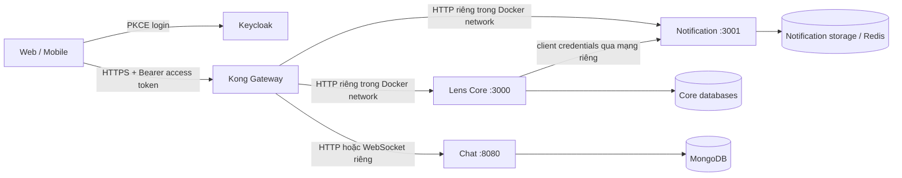

# Blueprint triển khai Kong Gateway cho Lens

**Trạng thái:** Baseline kiến trúc để triển khai sau khi Core API và hợp đồng giữa các service đã ổn định  
**Phiên bản tài liệu:** 1.0  
**Cập nhật:** 2026-10-02  
**Phạm vi:** Kong Gateway đứng trước Lens Core, Notification System và Chat Service; các service tiếp tục tự xác thực và phân quyền.

## 1. Mục tiêu

Kong là cổng HTTP/HTTPS công khai duy nhất cho API của Lens. Nó định tuyến request tới đúng service, thực thi các chính sách ở biên như TLS, CORS, giới hạn lưu lượng và giới hạn kích thước request. Kong không thay thế Keycloak, guard, phân quyền theo tài nguyên, kiểm tra chữ ký webhook hoặc bảo vệ dữ liệu trong từng service.

Blueprint này là cơ sở triển khai; trước khi đưa cấu hình vào chạy chỉ cần điền các endpoint chính xác từ OpenAPI đã chốt, địa chỉ public và danh sách origin theo môi trường. Không thiết kế lại ranh giới security ở giai đoạn đó.

## 2. Các quyết định kiến trúc

1. **Một public API host:** client chỉ gọi API qua Kong; Core, Notification và Chat không mở port ra Internet.
2. **Keycloak là Identity Provider:** Web/mobile đăng nhập với Authorization Code + PKCE. Service xác thực access token do Keycloak cấp.
3. **Kong là reverse proxy và lớp bảo vệ biên:** giai đoạn đầu không dùng Kong JWT plugin làm nguồn xác thực chính. Mỗi service vẫn xác thực `iss`, `aud`, chữ ký, `exp`, `sub` và quyền nghiệp vụ.
4. **Một hợp đồng public:** API HTTP sử dụng `/api/v1/...`; service giữ nguyên prefix này khi nhận request từ Kong. Chat cần chuẩn hóa đường dẫn hiện tại `/v1/api/...` trước khi nối vào gateway.
5. **Cấu hình Kong được quản lý trong Git:** v1 dùng DB-less/declarative config vì danh sách route và plugin được triển khai theo phiên bản, không cần sửa động qua Admin API.
6. **Service-to-service đi qua mạng riêng:** Core gọi Notification bằng service identity riêng (OAuth2 client credentials với audience/scope phù hợp) hoặc qua queue/outbox khi phù hợp. Không chuyển tiếp access token của người dùng làm danh tính service.
7. **Không tin header nhận dạng do client gửi:** service lấy user ID từ JWT đã xác thực (`sub`), không lấy từ `X-User-ID`, `X-User-Role` hoặc header tương tự.

## 3. Sơ đồ đích



Keycloak được client truy cập qua hostname HTTPS riêng; không đưa Admin Console/Admin API của Keycloak qua route API công khai. MinIO/object storage dùng URL upload/download có chữ ký nếu đã được thiết kế như vậy, không đưa luồng file lớn qua Kong một cách mặc định.

## 4. Hợp đồng route public

Kong chỉ khai báo các nhóm path thực sự có trong OpenAPI của từng service. Không tạo route wildcard `/` tới một backend và không công khai toàn bộ endpoint nội bộ.

| Service                          | Path public v1                                                                                                                                         | Quy tắc                                                                                                                                                                             |
| -------------------------------- | ------------------------------------------------------------------------------------------------------------------------------------------------------ | ----------------------------------------------------------------------------------------------------------------------------------------------------------------------------------- |
| Core                             | `/api/v1/auth/**`, `/api/v1/users/**`, `/api/v1/bookings/**`, `/api/v1/payments/**`, `/api/v1/subscriptions/**` và các nhóm còn lại trong OpenAPI Core | Thêm global prefix `/api/v1` vào Core trước khi bật route; `strip_path: false`. Bảng path cuối cùng được sinh từ OpenAPI, không dùng danh sách ví dụ này thay cho hợp đồng thực tế. |
| Notification                     | `GET /api/v1/notifications` và `POST /api/v1/notifications/mark-read`                                                                                  | Chỉ trả/đánh dấu notification thuộc user trong JWT. Không công khai route tạo notification cho `userId` tùy ý.                                                                      |
| Chat REST                        | `/api/v1/chat/**`                                                                                                                                      | Chuẩn hóa router Chat sang prefix public này; service kiểm tra JWT subject là participant và có quyền truy cập hội thoại.                                                           |
| Notification Socket.IO           | `/api/v1/socket.io` (namespace `/notification`)                                                                                                        | Giữ nguyên Upgrade/Connection headers; giới hạn origin; gateway xác thực token lúc handshake và đóng kết nối khi token hết hạn.                                                     |
| Health/readiness                 | Endpoint phục vụ health check nội bộ                                                                                                                   | Không route ra Internet; dùng health/status listener hoặc kiểm tra nội bộ từ orchestrator.                                                                                          |
| Notification mail/template/admin | Không có public route                                                                                                                                  | Chỉ gọi bằng service identity trên mạng riêng; nếu cần endpoint riêng, phải có role/scope machine-to-machine.                                                                       |

Các path phải phân quyền không giao nhau. Core sở hữu các resource path của mình; `notifications` và `chat` được dành riêng cho các service tương ứng. Mọi path public khác phải được thêm vào bảng ownership trước khi thêm route.

## 5. Trách nhiệm theo lớp

| Lớp                | Phải làm                                                                                                                                             | Không được coi là đã giải quyết                                                                                                     |
| ------------------ | ---------------------------------------------------------------------------------------------------------------------------------------------------- | ----------------------------------------------------------------------------------------------------------------------------------- |
| Client + Keycloak  | PKCE cho public client; giữ access token an toàn; gửi `Authorization: Bearer ...`                                                                    | Không nhúng client secret vào web/mobile; không gửi user ID tự khai làm danh tính                                                   |
| Kong               | HTTPS/TLS tại edge; route; CORS; rate limit; request size limit; request ID; log/metric; từ chối path không có route                                 | Không quyết định chủ sở hữu booking/conversation; không thay webhook signature verification; không phải nguồn duy nhất xác thực JWT |
| Từng service       | Kiểm tra JWT (`iss`, `aud`, chữ ký, `exp`, `sub`), role/scope; object-level authorization; DTO/schema validation; business limits; webhook signature | Không tin request chỉ vì nó đi qua Kong; không dựa trên `X-User-ID`                                                                 |
| Mạng nội bộ        | Chỉ Kong nhận traffic public; service và database chỉ nhận traffic từ network được phép                                                              | Docker network dùng chung không tự thay thế authentication giữa service                                                             |
| Service-to-service | Client credentials riêng cho từng caller; audience và role/scope hẹp; timeout, retry có giới hạn, log correlation ID                                 | Không dùng API key chung cho mọi service; không forward user bearer token để giả danh service                                       |

### Yêu cầu cụ thể trước khi bật Kong

- **Core:** hoàn tất danh sách endpoint và OpenAPI; thống nhất `/api/v1`; kiểm tra audience/role/scope theo route; mọi thao tác đọc/ghi resource kiểm tra ownership hoặc quyền admin; webhook thanh toán tự xác minh chữ ký, timestamp và chống replay.
- **Notification:** thêm authentication/authorization cho lệnh tạo notification và gửi mail/template; ràng buộc người nhận theo caller được phép; thêm DTO validation và giới hạn chống lạm dụng; chốt endpoint service-to-service. Endpoint `/api/v1/emails/send-otp` mà Core hiện gọi chưa khớp controller hiện có của Notification, nên phải sửa hợp đồng này trước khi định tuyến.
- **Chat:** chuẩn hóa prefix route; xác thực JWT subject; kiểm tra người gọi là participant trước khi đọc/ghi.
- **Notification realtime:** xác thực JWT lúc Socket.IO handshake; cấu hình origin allowlist; token hết hạn phải kết thúc session; không log bearer token hoặc token nằm trong `Sec-WebSocket-Protocol`.
- **Keycloak:** access token phải có audience đúng cho API; client web/mobile dùng PKCE; client credentials tách theo service và chỉ cấp role cần thiết. Nếu các service tiếp tục dùng public key tĩnh, quy trình xoay khóa phải được xác định; ưu tiên verifier có JWKS/cache/rotation đã cấu hình rõ.
- **Frontend:** bỏ mock identity/header `X-User-ID`; gọi API public qua Kong và dùng token thật. Mobile thay URL placeholder/localhost bằng base URL theo môi trường.

## 6. Bố trí triển khai

### Phát triển local

- Dùng Docker Compose tích hợp để đưa Kong, Core, Notification, Chat và dependency cần thiết vào cùng mạng `lens-network`.
- Host có thể publish proxy HTTP cho development, nhưng chỉ bind loopback nếu không cần thiết bị khác truy cập.
- Admin API nếu cần để debug chỉ bind `127.0.0.1`; không publish Kong Manager ra mạng.
- Service có thể chạy ngoài Docker trong lúc phát triển, nhưng khi đó upstream URL phải khai báo theo profile/dev environment riêng; không đưa `localhost` vào config chạy trong Kong container vì `localhost` là chính container Kong.

### Staging/production

- Chỉ mở cổng HTTPS công khai tại Kong hoặc load balancer đứng trước Kong. Nếu TLS được terminate trước Kong, chỉ tin `X-Forwarded-*` từ đúng địa chỉ proxy/load balancer đã khai báo trusted.
- Core/Notification/Chat không có public host port. Chúng chỉ join private service network; database/Redis không join public edge network.
- Admin API/Kong Manager không có public DNS, không mở firewall/host port. Cấu hình được nạp từ artifact trong CI/CD.
- Secret và certificate lấy từ secret store/secret mount theo môi trường; không ghi credential vào Compose, Kong YAML, image hoặc Git.
- Dùng một cấu hình/path khác nhau cho dev, staging và production; không dùng wildcard origin hay chung secret giữa môi trường.

### Điều chỉnh trên trạng thái repo hiện tại

Tại thời điểm viết tài liệu, [`.docker/compose.yaml`](../../.docker/compose.yaml) đã có Kong `3.6` ở DB mode, migration job, port proxy `8000`, Admin API `8001`, Manager `8002`, nhưng chưa có route/service cấu hình tới Core và Core chưa nằm trong stack đó. Khi triển khai blueprint:

1. Thay Kong `3.6` bằng một bản Gateway được duy trì tại thời điểm triển khai và pin patch/digest cụ thể; không dùng tag trôi nổi `latest`.
2. Chuyển Kong sang `KONG_DATABASE=off`, mount declarative config, bỏ migration job và cấu hình PostgreSQL riêng chỉ dùng cho Kong. Các database ứng dụng vẫn giữ nguyên.
3. Thêm upstream service alias ổn định cho Core, Notification và Chat trên private network; chỉ expose proxy listener.
4. Bỏ host mapping `8001`/`8002` ở production. Với local debug, giới hạn các port này vào loopback.
5. Tách mọi password đang ghi trực tiếp trong Compose sang `.env` local không commit hoặc secret store; rotate credential đã từng được sử dụng ngoài local.

DB-less phù hợp với v1 vì cấu hình route được review/version hóa cùng code. Mỗi Kong node nhận cùng một declarative artifact từ pipeline; mode này không tự đồng bộ state giữa các node. Nếu sau này cần thay đổi cấu hình động qua Admin API hoặc control plane/cluster quản lý state, mở một quyết định kiến trúc mới về DB-backed/decK/Konnect thay vì trộn cách quản lý.

## 7. Cấu trúc cấu hình Kong dự kiến

Đặt cấu hình ban đầu tại `.docker/kong/kong.yml` cùng Compose tích hợp. Khi có deployment/platform repository riêng, chuyển nguyên thư mục gateway sang repository đó và giữ cùng contract. Mẫu sau chỉ minh họa hình dạng; thay path bằng danh sách chính xác được sinh từ OpenAPI trước khi chạy:

Xem [các ví dụ cấu hình plugin chi tiết](KONG_PLUGIN_CONFIG_EXAMPLES.md) để review cấu hình CORS, rate limiting, request size, header filtering, correlation ID và Prometheus trước khi bật.

```yaml
_format_version: '3.0'
_transform: true

services:
  - name: core-api
    url: http://core-api:3000
    routes:
      - name: core-api-v1
        paths:
          - /api/v1/auth
          - /api/v1/users
          - /api/v1/bookings
          - /api/v1/payments
          # Bổ sung các prefix thực tế trong OpenAPI Core.
        strip_path: false

  - name: notification-api
    url: http://notification-api:3001
    routes:
      - name: notification-list
        paths:
          - /api/v1/notifications
        methods: [GET]
        strip_path: false
      - name: notification-mark-read
        paths:
          - /api/v1/notifications/mark-read
        methods: [POST]
        strip_path: false

  - name: chat-api
    url: http://chat-api:8080
    routes:
      - name: chat-api-v1
        paths:
          - /api/v1/chat
        strip_path: false

# Khai báo plugin ở global/service/route scope theo policy ở mục 8.
# Không tạo route cho mail/template, Admin API, database hoặc health nội bộ.
```

Tại lúc tích hợp, xác nhận route prefix của Core đã được cấu hình trong NestJS và API thực sự nhận URL giống public URL. Nếu không, dừng để chuẩn hóa service; không dựa vào nhiều lớp rewrite khó kiểm soát để che giấu contract lệch nhau.

## 8. Chính sách Gateway v1

| Chính sách            | Phạm vi đề xuất                                   | Thiết lập cần chốt                                                                                                                                                                                                                                        |
| --------------------- | ------------------------------------------------- | --------------------------------------------------------------------------------------------------------------------------------------------------------------------------------------------------------------------------------------------------------- |
| TLS                   | Toàn bộ public API                                | HTTPS bắt buộc; redirect HTTP→HTTPS hoặc không mở HTTP public; TLS đến upstream tùy hạ tầng                                                                                                                                                               |
| CORS                  | Global hoặc các route public cần browser          | Allowlist origin theo env; methods/headers tối thiểu (`Authorization`, `Content-Type`, request ID); không dùng `*` cùng credential; chỉ một lớp chịu trách nhiệm CORS                                                                                     |
| Rate limit            | Route auth/OTP, upload-init, search và public API | Chọn quota theo yêu cầu nghiệp vụ/load. DB-less: `local` chỉ phù hợp một node/dev và counter không cộng dồn giữa node; dùng Redis nếu cần counter chung. Rate limit theo account/OTP destination vẫn phải ở service, không tin header user do client gửi. |
| Request size          | API JSON                                          | Đặt giới hạn mặc định; ngoại lệ upload phải được thiết kế riêng, ưu tiên upload thẳng object storage bằng URL có chữ ký                                                                                                                                   |
| Header trust          | Tất cả route                                      | Xóa inbound `X-User-ID`, `X-User-Role` và header identity nội bộ nếu có; service xác thực JWT. Chỉ nhận forwarded headers từ trusted proxy.                                                                                                               |
| Request ID/log        | Tất cả route                                      | Sinh hoặc chuẩn hóa correlation ID; không log `Authorization`, cookie, OTP, email body, token query hoặc WebSocket token                                                                                                                                  |
| Timeout/retry         | Theo service và loại thao tác                     | Timeout rõ ràng; chỉ retry thao tác idempotent hoặc có idempotency key; không retry payment write vô điều kiện                                                                                                                                            |
| Authentication plugin | Chưa bật làm nguồn auth chính                     | Không bật Kong JWT plugin chỉ để tạo cảm giác đã bảo vệ API; giữ Keycloak token validation tại service cho tới khi có thiết kế thống nhất về OIDC/plugin edition và header trust                                                                          |

`local` rate limiting chỉ tăng bảo vệ theo từng instance. Tài liệu Kong nêu DB-less tương thích với `local` hoặc Redis policy; không dùng `cluster` policy với DB-less. Vì vậy khi scale nhiều Kong instance và cần quota dùng chung, chọn Redis policy hoặc rate limiter ở lớp phù hợp.

## 9. Thứ tự triển khai và tiêu chí hoàn tất

### Gate 0 — Core API sẵn sàng

- Core có OpenAPI đầy đủ và ổn định; mọi HTTP route thuộc `/api/v1`.
- JWT issuer/audience/role map đã chốt; các endpoint public/private và webhook được đánh dấu.
- Cấu hình service không phụ thuộc `localhost` khi chạy container.

**Hoàn tất khi:** có thể lấy OpenAPI của đúng bản Core sẽ deploy và mỗi path có owner/auth policy.

### Gate 1 — Chốt hợp đồng liên service và harden Notification

- Sửa mismatch giữa lời gọi email OTP từ Core và controller thật của Notification.
- Tạo rõ endpoint/command nội bộ, service token scope và chính sách recipient.
- Phân biệt route user-facing với send-mail/template/admin; chặn truy cập trái phép theo caller role.

**Hoàn tất khi:** request không có token service hoặc token sai scope không thể gửi mail/tạo notification tùy ý; user token chỉ thao tác dữ liệu của chính user.

### Gate 2 — Chuẩn hóa và harden Chat

- Chuyển REST sang public path `/api/v1/chat/...`; định tuyến Socket.IO của Notification qua `/api/v1/socket.io`.
- Xác nhận Chat kiểm tra JWT subject và participant; Notification Gateway kiểm tra JWT, Origin allowlist và session expiry cho Socket.IO.
- Dùng MongoDB có authentication và cấu hình replica set phù hợp deployment.

**Hoàn tất khi:** không truy cập được hội thoại chỉ bằng cách đoán ID; token hết hạn không giữ kết nối sống; token không xuất hiện trong log.

### Gate 3 — Dựng tích hợp deployment

- Đưa ba service vào Compose/platform manifest và private network chung hoặc cấu hình các upstream private tương đương.
- Không publish port service/database ra public host; khai báo health/readiness cho orchestrator.
- Bỏ static credentials khỏi Compose, cấu hình Keycloak audience/client roles theo môi trường.

**Hoàn tất khi:** Kong resolve được upstream bằng DNS/service name; từ Internet chỉ tới được proxy HTTPS.

### Gate 4 — Nạp cấu hình Kong

- Nâng khỏi `3.6`, pin phiên bản hỗ trợ; bật DB-less; tạo `kong.yml` từ path đã xác nhận.
- Thêm Service/Route cho từng path owner; thêm CORS, rate limit, size limit, request ID và timeout phù hợp.
- Không mở Admin API/Manager ra public; không thêm route internal/mail/health.

**Hoàn tất khi:** Kong khởi động với cấu hình, tất cả upstream healthy và path chưa khai báo trả 404.

### Gate 5 — Chuyển client và khóa bypass

- Cập nhật Web/Mobile sang public API base URL và token Keycloak thật; tắt mock mode/X-User-ID.
- Kiểm tra request hợp lệ, thiếu/sai/hết hạn token, sai role, truy cập resource người khác, CORS, rate limit, webhook sai chữ ký và WebSocket origin/token.
- Sau khi cutover ổn định, đóng port public trực tiếp của service; giữ rollback bằng cách deploy lại API release trước và cấu hình Kong version trước.

**Hoàn tất khi:** client không gọi được service nếu bypass Kong; user/business authorization vẫn được service kiểm tra; rollback đã rõ và log không rò secret.

## 10. Điều kiện không được bỏ qua khi go-live

- [ ] Kong image được pin patch/digest, không còn `kong:3.6` hoặc `latest`.
- [ ] Chỉ HTTPS proxy listener mở public; Admin API/Manager không public.
- [ ] Backend, database, Redis và MongoDB không mở public port.
- [ ] Không có password/key/token trong Compose, YAML, log hoặc image.
- [ ] Core, Notification, Chat tự xác thực JWT và phân quyền object-level.
- [ ] Service-to-service dùng client identity riêng và quyền tối thiểu.
- [ ] Mail/template/internal notification không có route public.
- [ ] CORS allowlist theo environment; không dùng wildcard với credentials.
- [ ] Rate limit được hiểu đúng khi chạy một hay nhiều Kong node.
- [ ] Có log/metric/alert cho upstream timeout, 4xx/5xx và rate limit mà không ghi bearer token.

## 11. Tài liệu tham khảo chính thức

- [Kong Services and Routes](https://docs.konghq.com/gateway/latest/get-started/services-and-routes/)
- [Kong DB-less and Declarative Configuration](https://docs.konghq.com/gateway/latest/production/deployment-topologies/db-less-and-declarative-config/)
- [Kong Gateway support policy](https://docs.konghq.com/gateway/latest/support-policy/) — kiểm tra lại bản được duy trì và patch mới nhất ngay trước khi pin image.
- [Securing the Kong Admin API](https://docs.konghq.com/gateway/latest/production/running-kong/secure-admin-api/)
- [Kong Rate Limiting](https://docs.konghq.com/hub/kong-inc/rate-limiting/)
- [Kong WebSocket proxying](https://docs.konghq.com/gateway/latest/how-kong-works/routing-traffic/)
- [Keycloak JavaScript adapter](https://www.keycloak.org/securing-apps/javascript-adapter) — public client và PKCE.
- [Keycloak protocol mappers](https://www.keycloak.org/admin-api/protocol-mappers) — cấu hình audience/claims.
